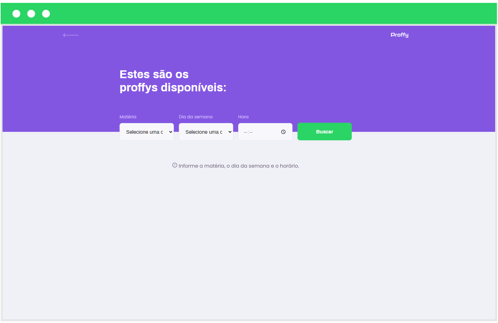
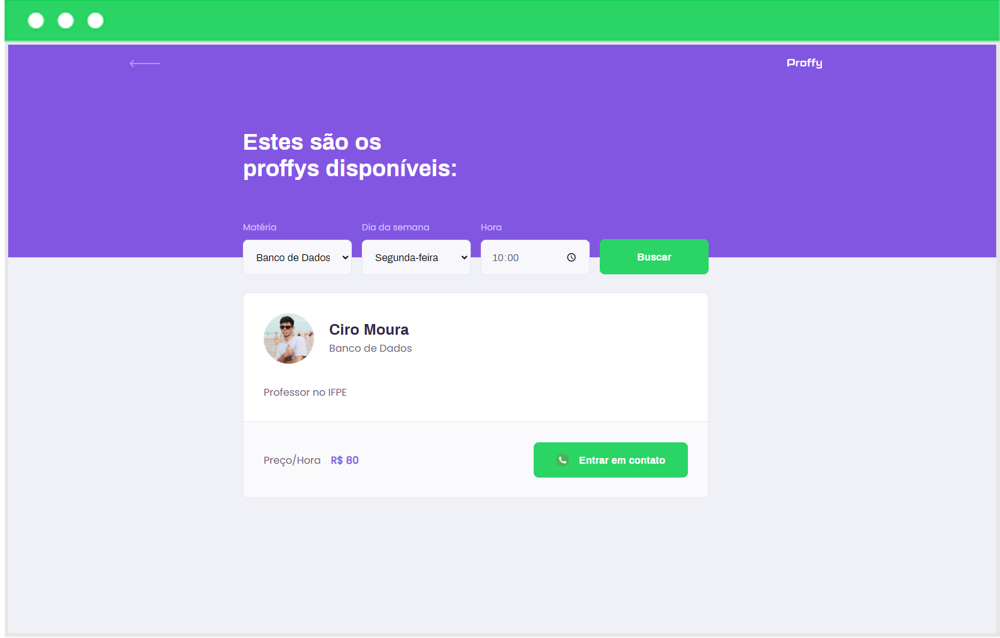
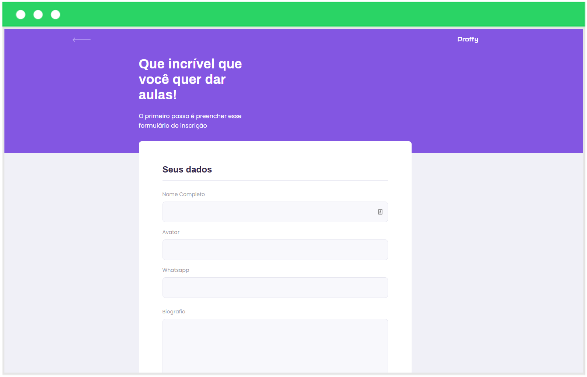
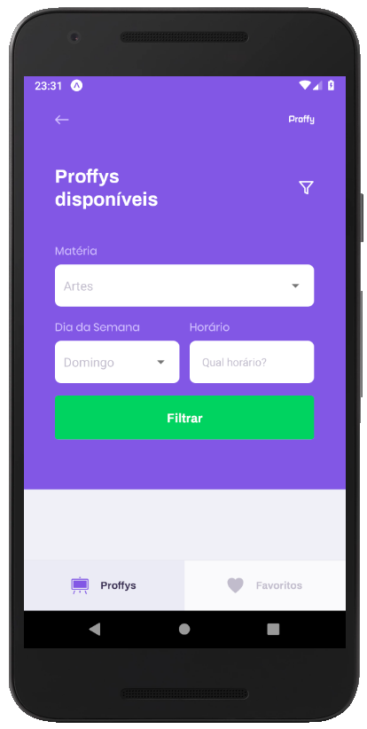

<h1 align="center">
 
</h1>


👨‍🏫 Proffy é uma aplicação que visa conectar professores a estudantes, sendo uma plataforma que auxilia a busca por professores de determinadas áreas e em dias específicos, facilitando a vida dos estudantes.

 

O projeto é dividido em três partes principais: backend, frontend e mobile. 
Tudo construído com tecnologias como: React, ReactNative, TypeScript, SQLite3, Node.js, Expo, entre outras. 

Os professores devem utilizar a plataforma web para se cadastrar. Ao fazer isso, deve ser enviado o link da imagem do seu perfil, seu nome, uma pequena biografia e seu número de WhatsApp,
que será utilizado para contato, além das informações sobre sua área, custo da hora aula, dias e horários disponíveis para atendimento.

Já na versão móvel (aplicativo), é possível acessar a plataforma como estudante para buscar por professores, de acordo com a disciplina, dia e horário desejado. 
É possível entrar em contato via whatsapp com um professor escolhido. Além disso, é possível adicionar professores em uma lista de favoritos.


🚀 Este projeto foi desenvolvido durante a segunda edição do evento NLW – Next Level Week, que foi oferecido pela Rocketseat. 
O NLW foi uma experiência online com muito conteúdo teórico e prático, sendo uma excelente experiência para aprender mais sobre desenvolvimento web e móvel.


### ⚙️ Para executar a aplicação

📦 Primeiro execute ```yarn install``` ou ```npm install``` nas pastas server (backend), web (frontend) e mobile, para instalar as dependências.

🖥️ Acesse a pasta server e execute ```yarn dev``` ou ```npm dev``` para lançar o backend da aplicação.

🌎 Para utilizar a versão web, acesse a pasta web e execute ```yarn start``` ou ```npm start```. Caso a página não abra automáticamente, acesse via **localhost:3000**.

📱 Já para utilizar a versão mobile (aplicativo), acesse a pasta mobile e execute ```yarn start``` ou ```npm start```. Como o projeto usa o Expo, uma página deverá ser aberta, mas caso não abra, acesse **localhost:19002**, leia o QR Code disponibilizado na página usando seu celular e utilize o aplicativo Expo para rodar a versão mobile no seu smartphone. Também é possível executar em um emulador Android/iOS.

Você pode encontrar esse mesmo projeto em outros repositórios, assim fica mais fácil esclarecer eventuais questionamentos. Além disso, outros desenvolvedores incluíram algumas modificações, explore:
- <a href="https://github.com/Newton-Duarte/proffy" target="_blank">Newton Duarte</a>;
- <a href="https://github.com/solrachix/Proffy" target="_blank">Carlos Miguel</a>;
- <a href="https://github.com/guilhermeorcezi/proffy" target="_blank">Guilherme Orcezi</a>;


#### Instrutor: [Diego Fernandes](https://github.com/diego3g) | CTO Rocketseat 🚀 

### 💻 Telas da versão web
 
 
 
 

### 📱 Telas da versão mobile
<div style="display: inline">
   
   
   
  
   
</div>
